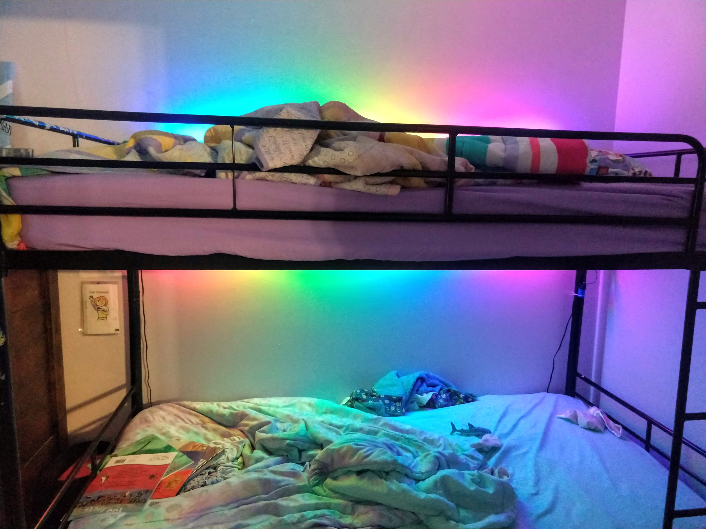

# bed-rgb-led-night-light
A Raspberry pi zero 2 w Bed light system for children that utilizes WS2812/NeoPixel RGB LEDs and a single button.
I built these as a christmas gift for my children, and they have it on most nights.  

## Requirements
 These hardware requirements are flexible.
### Hardware
Here is what I used to setup the system.
* 1x 50 RGB WS2812 led strip
* 1x [Raspberry Pi zero 2 w](https://www.raspberrypi.com/products/raspberry-pi-zero-2-w/) And case
* 1x [1N5822 3A diode](https://www.taydaelectronics.com/diodes/1n5822-schottky-diode-3a-40v.html) The 3a is the important part in order to support the current and the needed voltage drop for communicating at the needed 3.3V. The LED strip won't be as bright, but They are already bright enough.
* 1x [push button/switch](https://www.taydaelectronics.com/electromechanical/switches-key-pad/push-button.html)
* 1x Micro SDCard
* 1x 5v DC 4A Power supply (this is probably overkill)
* 2x 3-pin connectors To connect 
* 2x 2-pin connectors
* small amount of wire that can support 3 amps

The above are **not** affiliate links, but just the best source of these that I know of.

## Setup
### Flash micro SDCard
Install a t headless raspbian image

### Raspberry Pi Configuration

## Roadmap

The options here are limitless, such as connecting it to a google home. updating the python code to be a server and having a companion app that controls it for the children.

Initially I'm hoping to develop the following
* Time specific functions
** Dim after certain time(7:30pm)
** Auto shut off after(8:30pm)
** Ok to wake-up(but need to be quiet) indicator pixel(6:00am)
** Ok to Talk(but need to stay in the bedroom) indicator pixel(6:15am)
** Time to get up (cool if this could like to a nest mini - which is possible)
** Morning Auto shutoff

## Contributions

These aren't perfect instructions and if you need help, or have issues please post a issue. I'm usually pretty good about responding on github tickets. Contributions are always more than welcome.